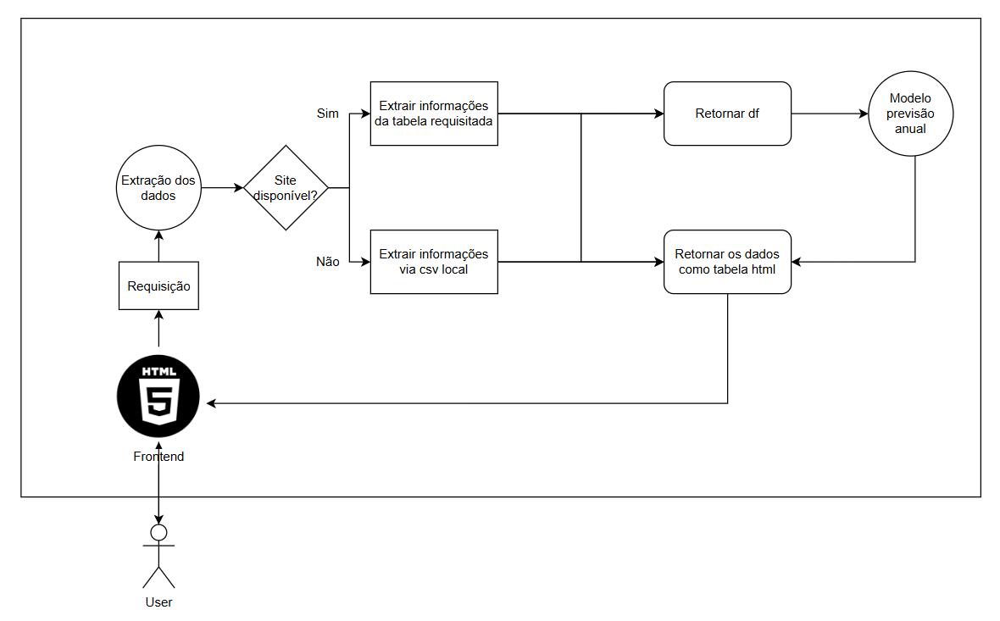

Introdução:
    Esse projeto é a primeira parte do tech challenge da faculdade FIAP para o curso de Machine Learning Enginer, com o objetivo sinalizado a baixo:
        • Criar uma Rest API em Python que faça a consulta no site da Embrapa. 
        • Sua API deve estar documentada. 
        • É recomendável (não obrigatório) a escolha de um método de autenticação (JWT, por exemplo). 
        • Criar um plano para fazer o deploy da API, desenhando a arquitetura do projeto desde a ingestão até a alimentação do modelo (aqui não é necessário elaborar um modelo de ML, mas é preciso que vocês escolham um cenário interessante em que a API possa ser utilizada). 
        • Fazer um MVP realizando o deploy com um link compartilhável e um repositório no github.

Arquitetura pensada:

Consultas:
